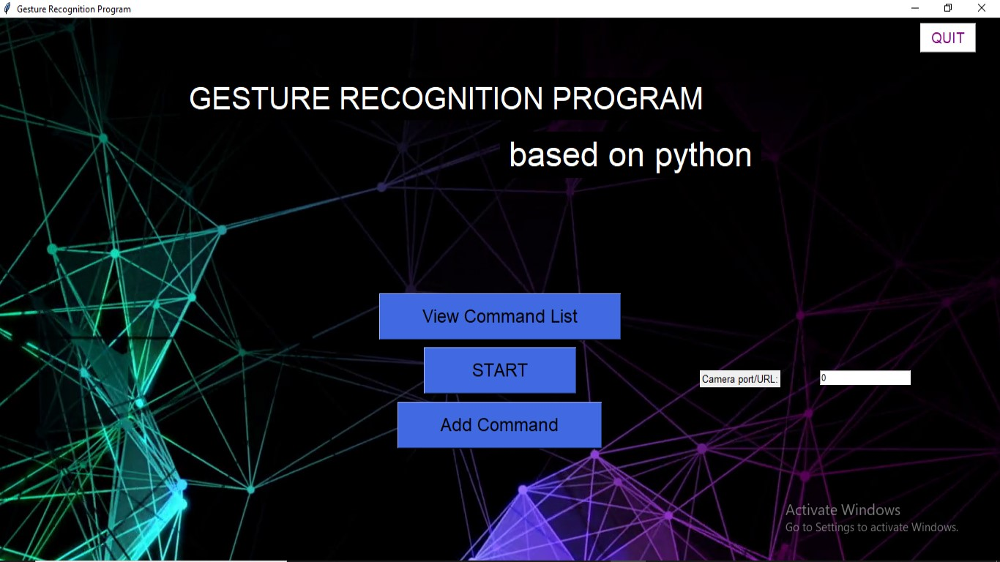
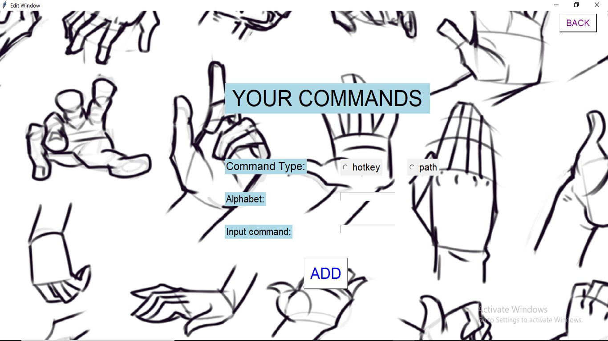
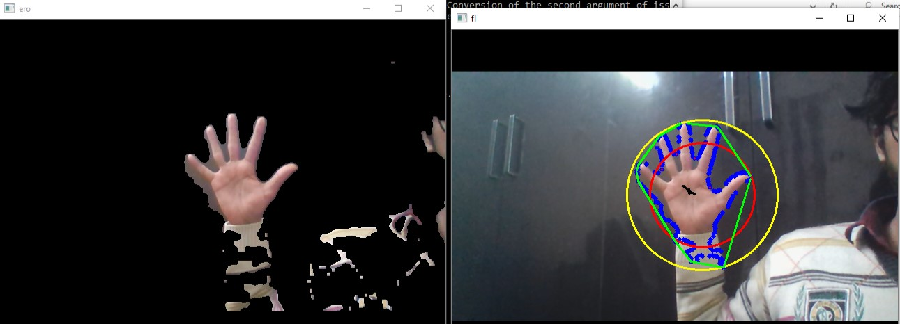

# Hand-Gesture

Recognizes alphabetical gestures made by hand movements.

##Samples

<h4>Menu of program made by Python tkinter</h4>

<h4>Adding custom command to alphabetical gesture</h4>

<h4>Hand recognition using color segmentation</h4>